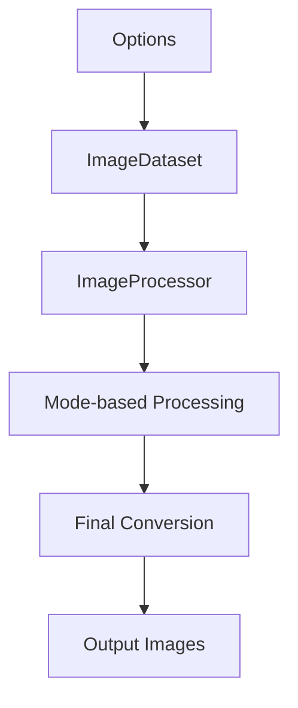

# 🌟 SHINIER - Complete Technical Documentation

<p align="center">
  
</p>

## 📋 Table of Contents

1. [Overview](#overview)
2. [Package Architecture](#package-architecture)
3. [MATLAB vs Python Differences](#matlab-vs-python-differences)
4. [Detailed Processing Modes](#detailed-processing-modes)
5. [Main Classes](#main-classes)
6. [Utility Functions](#utility-functions)
7. [Implemented Algorithms](#implemented-algorithms)
8. [Memory Management and Performance](#memory-management-and-performance)
9. [Testing and Validation](#testing-and-validation)
10. [Advanced Usage Examples](#advanced-usage-examples)

---

## 🎯 Overview

**SHINIER** is a modern Python implementation of the **SHINE** (Spectrum, Histogram, and Intensity Normalization and Equalization) toolbox, originally developed in MATLAB by [Willenbockel et al. (2010)](https://doi.org/10.3758/BRM.42.3.671).

### Main Objectives
- **Compatibility**: Maintain compatibility with the original MATLAB implementation
- **Performance**: Optimize performance for large datasets
- **Extensibility**: Object-oriented architecture for easy extensions
- **Precision**: Reduce rounding errors in multi-step calculations

---

## 🏗️ Package Architecture

### Module Structure

```
shinier/
├── __init__.py          # Package entry point
├── Options.py           # Parameter configuration
├── ImageDataset.py      # Image collection management
├── ImageListIO.py       # Image file input/output
├── ImageProcessor.py    # Main image processing
├── SHINIER.py          # Command-line interface
└── utils.py            # Utility functions and MATLAB operators
```

### Processing Flow



---

## 🔬 MATLAB vs Python Differences

### 1. **Rounding Operators**

#### MATLAB `round()`
```matlab
>> round([2.5, 3.5, -2.5, -3.5])
ans = [3, 4, -3, -4]
```
- Rounds **away from zero** (round-away-from-zero)
- Deterministic behavior for values exactly halfway

#### Python `numpy.round()` - IEEE 754 Standard
```python
>>> np.round([2.5, 3.5, -2.5, -3.5])
array([2., 4., -2., -4.])
```
- Rounds **to nearest even** (round-half-to-even, "Bankers' Rounding")
- **IEEE 754-2019 Standard** compliant (recommended default)
- **Statistically unbiased** for large datasets
- **Reduces cumulative rounding errors** in iterative computations

#### SHINIER Solution - Compatibility vs Standards
```python
class MatlabOperators:
    @staticmethod
    def round(x):
        """Simulates MATLAB's rounding behavior for compatibility"""
        return np.sign(x) * np.ceil(np.floor(np.abs(x) * 2) / 2)
```

**Scientific Rationale:**

While SHINIER provides MATLAB-compatible rounding for **legacy compatibility**, the **IEEE 754-2019 standard** recommends round-half-to-even because:

1. **Statistical Unbiasedness**: Round-half-to-even produces unbiased results when rounding large datasets
2. **Error Minimization**: Reduces cumulative rounding errors in iterative algorithms
3. **Industry Standard**: Used by most modern computing systems (Python, R, Julia, etc.)
4. **Numerical Stability**: Better performance in floating-point arithmetic

**References:**
- **IEEE 754-2019**: "IEEE Standard for Floating-Point Arithmetic"
- **Goldberg, D. (1991)**: "What Every Computer Scientist Should Know About Floating-Point Arithmetic"
- **Kahan, W. (1996)**: "IEEE Standard 754 for Binary Floating-Point Arithmetic"
- **Higham, N.J. (2002)**: "Accuracy and Stability of Numerical Algorithms"

**Recommendation**: Use `legacy_mode=False` (default) for scientifically robust results, `legacy_mode=True` only for MATLAB compatibility validation.

### 2. **Integer Type Conversion**

#### MATLAB `uint8()`
```matlab
>> uint8([2.5, 3.5, -2.5, 255.5])
ans = [3, 4, 0, 255]
```
- Rounds to nearest integer
- **Clips** values between [0, 255]

#### Python `numpy.astype('uint8')`
```python
>>> np.array([2.5, 3.5, -2.5, 256, 257]).astype('uint8')
array([2, 3, 254, 0, 1], dtype=uint8)
```
- **Truncates** decimal values
- **Wrap-around** behavior for out-of-range values

#### SHINIER Solution
```python
@staticmethod
def uint8(x):
    """Replicates MATLAB's uint8 behavior"""
    return np.uint8(np.clip(MatlabOperators.round(x), 0, 255))
```

### 3. **Standard Deviation Calculation**

#### MATLAB `std2()`
```matlab
>> A = rand(100, 100);
>> std2(A)
ans = 0.287630126526993
```
- Uses **N-1** divisor (unbiased estimator)

#### Python `numpy.std()` - Statistical Best Practice
```python
>>> A = np.random.rand(100, 100)
>>> np.std(A)
0.28761574466111084
```
- Uses **N** divisor (biased estimator) by default
- **Population standard deviation** (mathematically correct for complete populations)
- **Consistent with most statistical software** (R, Julia, etc.)

#### SHINIER Solution - Scientific Flexibility
```python
@staticmethod
def std2(x):
    """Replicates MATLAB's std2 function for compatibility"""
    return np.std(x, ddof=1)  # ddof=1 for N-1 (sample std)
```

**Statistical Rationale:**

The choice between N and N-1 divisors depends on the **statistical context**:

- **N divisor**: Population standard deviation (when you have the complete population)
- **N-1 divisor**: Sample standard deviation (when estimating population from sample)

**SHINIER Approach**: Provides both options through `ddof` parameter, allowing users to choose based on their statistical requirements.

### 4. **RGB to Grayscale Conversion**

#### MATLAB `rgb2gray()` - Legacy Standard
```matlab
% Uses Rec.ITU-R BT.601-7 (SD monitors)
Y' = 0.299 * R + 0.587 * G + 0.114 * B
```
- **Rec.ITU-R BT.601-7**: Standard-Definition television (1982)
- **Legacy standard** optimized for CRT monitors

#### SHINIER `rgb2gray()` - Modern Standards Support
```python
def rgb2gray(image, recommendation='rec709'):
    """RGB to grayscale conversion with multiple luma coefficient standards"""
    rgb_luma_coefficients = {
        'equal': [0.333, 0.333, 0.333],  # Equal weighting (not perceptually accurate)
        'rec601': [0.298936021293775, 0.587043074451121, 0.114020904255103],  # SD legacy
        'rec709': [0.2126, 0.7152, 0.0722],  # HD standard (recommended)
        'rec2020': [0.2627, 0.6780, 0.0593]   # UHD standard
    }
    weights = rgb_luma_coefficients[recommendation]
    return np.dot(image.astype(np.float64), weights)
```

**Scientific Rationale:**

Different luma coefficients are optimized for different **display technologies** and **viewing conditions**:

- **Rec.ITU-R BT.709**: **Recommended default** for modern displays (HD, 4K)
- **Rec.ITU-R BT.2020**: **Future-proof** for UHD/HDR displays
- **Rec.ITU-R BT.601**: **Legacy compatibility** for SD displays

**References:**
- **Poynton, Charles (1997)**: "Frequently Asked Questions about Color"
- **ITU-R BT.601-7 (2011)**: "Studio encoding parameters of digital television for standard 4:3 and wide-screen 16:9 aspect ratios"
- **ITU-R BT.709-6 (2015)**: "Parameter values for the HDTV standards for production and international programme exchange"
- **ITU-R BT.2020-2 (2015)**: "Parameter values for ultra-high definition television systems"

**SHINIER Advantage**: Provides **multiple standards** allowing users to choose the most appropriate for their display technology and research context. 

---

## ⚙️ Detailed Processing Modes

### Mode 1: Luminance Matching Only
```python
mode = 1  # lum_match only
```
**Algorithm:**
- If `target_lum` is None or equals `(0, 0)`: compute target parameters from the dataset
  - `mean` = average of image means
  - `std`  = average of image standard deviations
- Otherwise (when `target_lum=(mean, std)` is provided): use it directly as the target
- Apply linear rescaling per image: `new_pixel = (pixel - mean) * (target_std/std) + target_mean`

**Specific Parameters:**
- `target_lum`: Optional tuple `(mean, std)` where `mean ∈ [0, 255]` and `std ∈ [0, +∞)`. If omitted or `(0, 0)`, dataset averages are used
- `safe_lum_match`: If True, automatically adjusts `(target_mean, target_std)` to keep all pixel values within [0, 255] (values may differ slightly from the requested target)

### Mode 2: Histogram Matching Only
```python
mode = 2  # hist_match only
```
**Available Algorithms:**
- **Exact specification** (`hist_specification=0`): Coltuc, Bolon & Chassery (2006) algorithm
- **Specification with noise** (`hist_specification=1`): Legacy version with noise addition

**SSIM Optimization:**
- `hist_optim=1`: SSIM-based optimization (Avanaki, 2009)
- `hist_iterations`: Number of iterations (default: 10)
- `step_size`: Step size (default: 34)

### Mode 3: Spatial Frequency Matching Only
```python
mode = 3  # sf_match only
```
**Match spatial frequencies of input images to a target rotational spectrum.** 

**Algorithm (summary):**
1) Convert images to float [0,255] (H×W×C) and prepare optional masks/bit-depth.
2) Build the target rotational magnitude spectrum (provided or averaged from inputs).
3) For each image, compute FFT, replace the radial magnitude profile with the target while preserving phase, then inverse FFT.
4) Apply rescaling per `options.rescaling` (0 none, 1 per-image, 2 global, 3 average) and clip to valid range.
5) Store float255 outputs and optionally log/plot spectral diagnostics.

---

### Mode 4: Spectrum Matching Only
```python
mode = 4  # spec_match only
```
**Match the full magnitude spectrum of images to a target spectrum (2D magnitude, not only rotational average).**

**Algorithm (summary):**
1) Convert images to float [0,255] (H×W×C) and consider masks if provided.
2) Build the target 2D magnitude spectrum (provided or element-wise average of input magnitudes).
3) For each image, compute FFT, replace the full magnitude by the target while preserving phase, then inverse FFT.
4) Apply rescaling per `options.rescaling` and clip to the valid intensity range.
5) Store float255 outputs and optionally log or visualize spectrum-related diagnostics.

### Composite Modes (5-8)

#### Mode 5: Histogram + Spatial Frequency
```python
mode = 5  # hist_match → sf_match
```

#### Mode 6: Histogram + Spectrum
```python
mode = 6  # hist_match → spec_match
```

#### Mode 7: Spatial Frequency + Histogram
```python
mode = 7  # sf_match → hist_match
```

#### Mode 8: Spectrum + Histogram (Recommended)
```python
mode = 8  # spec_match → hist_match
```

**High Numerical Precision:**
- Composite modes use temporary floating-point precision
- Reduces rounding errors in multi-step calculations

### Mode 9: Dithering Only
```python
mode = 9  # only dithering
```

---

## 🏛️ Main Classes

### `Options`
Centralized configuration class for all processing parameters.

```python
class Options:
    def __init__(
        # Folders and formats
        images_format: str = 'png',
        input_folder: Union[str, Path] = Path('./../INPUT'),
        output_folder: Union[str, Path] = Path('./../OUTPUT'),
        
        # Masks and figure-ground separation
        masks_format: str = 'png',
        masks_folder: Optional[Union[str, Path]] = None,
        whole_image: Literal[1, 2, 3] = 1,
        background: Union[int, float] = 300,
        
        # Processing mode
        mode: Literal[1, 2, 3, 4, 5, 6, 7, 8, 9] = 8,
        as_gray: Literal[0, 1, 2, 3, 4] = 0,
        dithering: Literal[0, 1, 2] = 1,
        
        # Memory management
        conserve_memory: bool = True,
        seed: Optional[int] = None,
        legacy_mode: bool = False,
        
        # Luminance matching
        safe_lum_match: bool = False,
        target_lum: Optional[Iterable[Union[int, float]]] = (0, 0),
        
        # Histogram matching
        hist_specification: Literal[0, 1] = 0,
        hist_optim: Literal[0, 1] = 0,
        hist_iterations: int = 10,
        step_size: int = 34,
        target_hist: Optional[np.ndarray] = None,
        
        # Fourier matching
        rescaling: Optional[Literal[0, 1, 2, 3]] = 2,
        target_spectrum: Optional[np.ndarray] = None,
        iterations: int = 2
    ):
```

### `ImageDataset`
Management of image and mask collections with state tracking.

```python
class ImageDataset:
    def __init__(
        self,
        images: ImageListType = None,
        masks: ImageListType = None,
        options: Optional[Options] = None
    ):
        self.images: ImageListIO      # Image collection
        self.masks: ImageListIO       # Mask collection
        self.n_images: int           # Number of images
        self.n_masks: int            # Number of masks
        self.processing_logs: List   # Processing log
        self.options: Options        # Configuration options
```

### `ImageProcessor`
Main image processing class.

```python
class ImageProcessor:
    def __init__(
        self, 
        dataset: ImageDataset, 
        options: Optional[Options] = None, 
        verbose: Literal[0, 1, 2] = 0
    ):
        self.dataset: ImageDataset
        self.options: Options
        self.verbose: Literal[0, 1, 2]
        self.log: List              # Processing log
        self.validation: List      # Validation results
```

---

## Visualization Functions

```python
def imhist_plot(img, bins=256, figsize=(8, 6)):
    """Image histogram plotting"""
    
def spectrum_plot(spectrum, figsize=(10, 8)):
    """Magnitude spectrum plotting"""
    
def sf_plot(sf_profile, figsize=(8, 6)):
    """Spatial frequency profile plotting"""
```

---

## 🧮 Implemented Algorithms

### 1. Exact Histogram Specification
**Reference:** Coltuc, D., Bolon, P., & Chassery, J. M. (2006). Exact histogram specification.

**Algorithm:**
1. Calculate cumulative distribution function (CDF) of source image
2. Calculate CDF of target histogram
3. Create mapping table based on CDFs
4. Apply mapping pixel by pixel

### 2. SSIM Optimization for Histogram
**Reference:** Avanaki, A. N. (2009). Exact histogram specification for digital images using a variational approach.

**Algorithm:**
1. Initial calculation of target histogram
2. Successive iterations with SSIM-based adjustment
3. Step size optimization for fast convergence

### 3. Floyd-Steinberg Dithering
**Reference:** Floyd, R. W., & Steinberg, L. (1976). An adaptive algorithm for spatial grey scale.

**Algorithm:**
1. Sequential image traversal (left to right, top to bottom)
2. Calculate quantization error for each pixel
3. Distribute error to neighboring pixels with different weights.

### 4. Noisy Bit Dithering
**Reference:** Allard, R., & Faubert, J. (2008). The noisy-bit method for digital halftoning.

**Algorithm:**
1. Add controlled noise to each pixel
2. Quantize with rounding
3. Preserve overall image structure

---

## 💾 Memory Management and Performance

### Memory Conservation Mode (`conserve_memory=True`)

**Operation:**
1. Create temporary directory `/tmp/shinier-<pid>/`
2. Save images as `.npy` format in temporary directory
3. Load only one image in memory at a time
4. Automatic cleanup at end of processing

**Advantages:**
- Significant RAM usage reduction
- Ability to process very large datasets
- Automatic temporary file management

**Implementation Code:**
```python
class ImageListIO:
    def __init__(self, input_data, conserve_memory=True, ...):
        if conserve_memory:
            self._setup_temp_storage()
            self._save_to_temp(input_data)
        else:
            self._load_all_images(input_data)
```

### NumPy Optimizations

**Optimized FFT:**
```python
# Use np.fft.rfft2 for real images (faster)
if image.dtype in [np.float32, np.float64]:
    fft_result = np.fft.rfft2(image)
else:
    fft_result = np.fft.fft2(image)
```

**Vectorized Operations:**
```python
# Exact histogram specification using pixel ordering
def exact_histogram(image, target_hist, binary_mask=None, n_bins=None):
    """
    Implements exact histogram specification using pixel ordering algorithm
    Reference: Coltuc, Bolon & Chassery (2006)
    """
    # Get pixel order values for ranking
    im_sort, OA = pixel_order(image)
    
    # For each channel, assign pixels based on sorted order
    for channel in range(n_channels):
        foreground_indices = binary_mask[:, :, channel]
        pix_ord = im_sort[:, :, channel][foreground_indices]
        sorted_indices = np.argsort(pix_ord)
        
        # Create intensity values based on target histogram
        Hraw = np.repeat(np.arange(L), new_target_hist)
        Hraw_sorted[sorted_indices] = Hraw
        
        # Assign back to output image
        im_out[:, :, channel][foreground_indices] = Hraw_sorted
```

---

## 🧪 Testing and Validation

### Unit Tests

**Tested Components:**
- `Options`: Parameter validation
- `ImageListIO`: Image loading/saving
- `ImageDataset`: Collection management
- `ImageProcessor`: Image processing

**Test Images:**
- Noise-generated images for testing
- Binary masks for figure-ground separation
- Reference images for validation

### MATLAB Validation

**Comparison Metrics:**

These metrics are used to validate the quality of histogram matching by comparing the **target histogram** with the **obtained histogram** from the processed image:

- **RMSE**: Root Mean Square Error between target and obtained histogram counts
- **SSIM**: Structural Similarity Index between original and processed images  
- **Correlation**: Pearson correlation coefficient between target and obtained histogram distributions

**How they work in SHINIER:**

```python
def hist_match(self):
    """Histogram matching with validation metrics"""
    # After histogram specification
    final_hist = imhist(image=new_image, mask=self.bool_masks[idx], n_bins=n_bins, normalized=True)
    
    # Compare target vs obtained histogram
    corr = np.corrcoef(final_hist.flatten(), target_hist.flatten())
    rmse = compute_rmse(final_hist.flatten(), target_hist.flatten())
    
    # Compare original vs processed image structure
    sens, ssim = ssim_sens(image/n_bins, Y/n_bins, n_bins=2)
    
    # Validation: ideal values are correlation=1, RMSE=0
    self._validate(
        observed=[corr[0, 1], rmse], 
        expected=[1, 0], 
        measures_str=[
            'correlation (target vs obtained histogram count)', 
            'RMS error (target vs obtained histogram count)'
        ]
    )
```

**Metric Interpretations:**
- **Correlation ≈ 1.0**: Perfect histogram match (target and obtained histograms are identical)
- **RMSE ≈ 0**: No error between target and obtained histogram counts
- **SSIM ≈ 1.0**: Perfect structural similarity (preserves image structure while matching histogram)

---

## 📚 Advanced Usage Examples

- See `Example_usage.ipynb` in the documemntation folder for:
  - Batch processing with masks
  - Custom histogram matching
  - Legacy mode (MATLAB compatibility)
  - Processing with a custom target spectrum
  - Interactive CLI usage

Examples in this README have been intentionally minimized; please open the notebook for complete, executable code.

---

## 🔧 Troubleshooting and Optimization

### Common Issues

**1. Out-of-range values in luminance matching**
```python
# Solution: Enable safety mode
options = Options(
    safe_lum_match=True,  # Automatically adjusts parameters
    mode=1
)
```

**2. Excessive memory usage**
```python
# Solution: Enable memory conservation
options = Options(
    conserve_memory=True,  # Load one image at a time
    mode=8
)
```

**3. Results different from MATLAB**
```python
# Solution: Enable legacy mode
options = Options(
    legacy_mode=True,  # Uses exact MATLAB algorithms
    mode=8
)
```

### Performance Optimization

**1. Image Format Choice**
```python
# PNG: Lossless compression, good for masks
# TIFF: Professional format, metadata support
# JPEG: Lossy compression, avoid for processing
```

**2. Image Size**
```python
# For very large images, consider:
# - conserve_memory=True mode
# - Block processing
# - Preliminary resolution reduction
```

**3. Number of Iterations**
```python
# Mode 8 (recommended): 5 iterations usually sufficient (see SHINE article)
# Mode with SSIM optimization: 5-10 iterations
# More iterations = better quality but longer computation time
```

---

## 📖 References

### Main Publications
1. **Willenbockel, V., Sadr, J., Fiset, D., Horne, G. O., Gosselin, F., & Tanaka, J. W.** (2010). Controlling low-level image properties: The SHINE toolbox. *Behavior Research Methods*, 42(3), 671-684.

2. **Coltuc, D., Bolon, P., & Chassery, J. M.** (2006). Exact histogram specification. *IEEE Transactions on Image Processing*, 15(5), 1143-1152.

3. **Avanaki, A. N.** (2009). Exact histogram specification for digital images using a variational approach. *Journal of Visual Communication and Image Representation*, 20(7), 505-515.

4. **Floyd, R. W., & Steinberg, L.** (1976). An adaptive algorithm for spatial grey scale. *Proceedings of the Society of Information Display*, 17, 75-77.

5. **Allard, R., & Faubert, J.** (2008). The noisy-bit method for digital halftoning. *Journal of the Optical Society of America A*, 25(8), 1980-1989.

### ITU-R Standards
- **Rec.ITU-R BT.601-7**: Luma coefficients for SD monitors
- **Rec.ITU-R BT.709**: Luma coefficients for HD monitors
- **Rec.ITU-R BT.2020**: Luma coefficients for UHD monitors

---

## 🤝 Contribution and Development

### Code Structure
- **Documentation**: Google-style docstrings
- **Tests**: Unit tests with reference images
- **Validation**: Systematic comparison with MATLAB
- **Performance**: Continuous profiling and optimization

### Future Improvements
- [ ] 16-bit image support
- [ ] GPU processing with CuPy
- [ ] Graphical interface
- [ ] RAW format support
- [ ] Advanced dithering algorithms

---

<p align="center">
  <strong>Developed with ❤️ for the vision research community</strong><br>
  <em>Version 0.1.0 - Complete technical documentation</em>
</p>