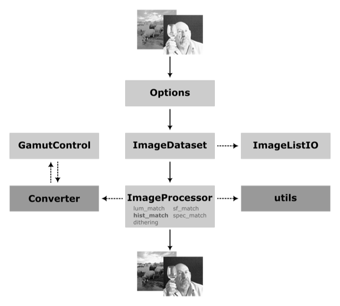
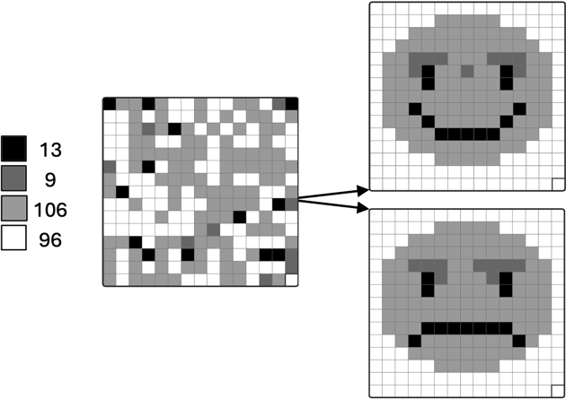
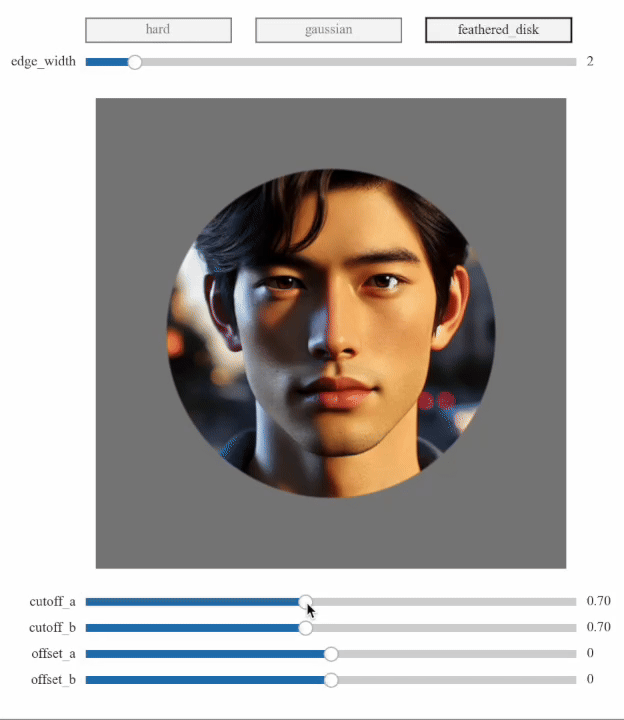

```text
   ███████╗██╗  ██╗██╗███╗  ██╗██╗███████╗██████╗
   ██╔════╝██║  ██║██║████╗ ██║██║██╔════╝██╔══██╗
   ███████╗███████║██║██╔██╗██║██║█████╗  ██████╔╝
   ╚════██║██╔══██║██║██║╚████║██║██╔══╝  ██╔══██╗
   ███████║██║  ██║██║██║ ╚███║██║███████╗██║  ██║
   ╚══════╝╚═╝  ╚═╝╚═╝╚═╝  ╚══╝╚═╝╚══════╝╚═╝  ╚═╝
```

[](../LICENSE)
[]()
[](https://pypi.org/project/shinier/)
---

# Documentation
<!-- readthedocs-content-start -->

## Table of Contents

1. [Overview](#overview)
2. [Package Architecture](#package-architecture)
3. [MATLAB vs Python Differences](#matlab-vs-python-differences)
4. [Detailed Processing Modes](#detailed-processing-modes)
5. [Border Artifacts and FFT Padding](#border-artifacts-and-fft-padding)
6. [Main Classes](#main-classes)
7. [Visualization Functions](#visualization-functions)
8. [Implemented Algorithms](#implemented-algorithms)
9. [Memory Management and Performance](#memory-management-and-performance)
10. [Testing and Validation](#testing-and-validation)
11. [Troubleshooting and Optimization](#troubleshooting-and-optimization)
12. [Additional Resources](#additional-resources)

---

<a id="overview"></a>
## Overview

**SHINIER** is a modern Python implementation of the **SHINE** (Spectrum, Histogram, and Intensity Normalization, Equalization, and Refinements) toolbox, originally developed in MATLAB by [Willenbockel et al. (2010)](https://doi.org/10.3758/BRM.42.3.671). This new version implemented new options (e.g., color management, dithering and [Coltuc, Bolon & Chassery (2006)](https://www.cin.ufpe.br/~if751/projetos/artigos/Exact%20Histogram%20Specification.pdf) exact histogram specification algorithm) and refined the previous ones.

**References**:
- [Salvas-Hébert, M., Dupuis-Roy, N., Landry, C., Charest, I., & Gosselin, F. (2026). SHINIER: An open-source Python package for controlling low-level image properties. *SoftwareX*, *35*, Article 102884.](https://doi.org/10.1016/j.softx.2026.102884)
- [Willenbockel, V., Sadr, J., Fiset, D., Horne, G. O., Gosselin, F., & Tanaka, J. W. (2010). Controlling low-level image properties: The SHINE toolbox. *Behavior Research Methods*, *42*(3), 671–684.](https://doi.org/10.3758/BRM.42.3.671)

### Main Objectives
- **Compatibility**: Maintain compatibility with the original MATLAB implementation
- **Performance**: Optimize performance for large datasets
- **Extensibility**: Object-oriented architecture for easy extensions
- **Precision**: Reduce rounding errors in multi-step calculations

---

<a id="package-architecture"></a>
## Package Architecture

### Module Structure

```
shinier/src
├── color                # Color-space conversion
│   ├── Converter.py     # Color conversion and transfer functions
│   └── GamutControl.py  # Gamut management and repairs
│   └── ...
├── __init__.py          # Package entry point
├── base.py              # Customized Pydantic base-model
├── ImageDataset.py      # Image collection management
├── ImageListIO.py       # Image file input/output
├── ImageProcessor.py    # Main image processing
├── Options.py           # Parameter configuration
├── SHINIER.py          # Command-line interface
├── utils.py            # Utility functions and MATLAB operators
└── ...
```

### Processing Flow



---

<a id="matlab-vs-python-differences"></a>
## MATLAB vs Python Differences

### 1. **Rounding Operators**

#### MATLAB `round()`
```matlab
>> round([2.5, 3.5, -2.5, -3.5])
ans = [3, 4, -3, -4]
```
- Rounds **away from zero** (round-away-from-zero)
- Deterministic behavior for values exactly halfway

#### Python `numpy.round()` - IEEE 754 Standard
```python
>>> np.round([2.5, 3.5, -2.5, -3.5])
array([2., 4., -2., -4.])
```
- Rounds **to nearest even** (round-half-to-even, "Bankers' Rounding")
- **IEEE 754-2019 Standard** compliant (recommended default for binary formats)
- **Statistically unbiased** for large datasets
- **Reduces cumulative rounding errors** in iterative computations

#### SHINIER Solution - Compatibility vs Standards
```python
class MatlabOperators:
    @staticmethod
    def round(x):
        """Simulates MATLAB's rounding behavior for compatibility"""
        return np.sign(x) * np.ceil(np.floor(np.abs(x) * 2) / 2)
```

**Scientific Rationale:**

While SHINIER provides MATLAB-compatible rounding for **legacy compatibility**, the **IEEE 754-2019 standard** recommends round-half-to-even because:

1. **Statistical Unbiasedness**: Round-half-to-even produces unbiased results when rounding large datasets
2. **Error Minimization**: Reduces cumulative rounding errors in iterative algorithms
3. **Industry Standard**: Used by most modern computing systems (Python, R, Julia, etc.)
4. **Numerical Stability**: Better performance in floating-point arithmetic

**References:**
- [**IEEE 754-2019**](https://ieeexplore.ieee.org/document/8766229): "IEEE Standard for Floating-Point Arithmetic"
- [**Goldberg, D. (1991)**](https://docs.oracle.com/cd/E19957-01/806-3568/ncg_goldberg.html): "What Every Computer Scientist Should Know About Floating-Point Arithmetic"
- [**Kahan, W. (1996)**](https://people.eecs.berkeley.edu/~wkahan/ieee754status/IEEE754.PDF): "IEEE Standard 754 for Binary Floating-Point Arithmetic"

**Recommendation**: Use `legacy_mode=False` (default) for scientifically robust results, `legacy_mode=True` only for MATLAB compatibility validation.

### 2. **Integer Type Conversion**

#### MATLAB `uint8()`
```matlab
>> uint8([2.5, 3.5, -2.5, 255.5])
ans = [3, 4, 0, 255]
```
- Rounds to nearest integer
- **Clips** values between [0, 255]

#### Python `numpy.astype('uint8')`
```python
>>> np.array([2.5, 3.5, -2.5, 256, 257]).astype('uint8')
array([2, 3, 254, 0, 1], dtype=uint8)
```
- **Truncates** decimal values
- **Wrap-around** behavior for out-of-range values

#### SHINIER Solution
```python
@staticmethod
def uint8(x):
    """Replicates MATLAB's uint8 behavior"""
    return np.uint8(np.clip(MatlabOperators.round(x), 0, 255))
```

### 3. **Standard Deviation Calculation**

#### MATLAB `std2()`
```matlab
>> A = rand(100, 100);
>> std2(A)
ans = 0.287630126526993
```
- Uses **N-1** divisor (unbiased estimator)

#### Python `numpy.std()` - Statistical Best Practice
```python
>>> A = np.random.rand(100, 100)
>>> np.std(A)
0.28761574466111084
```
- Uses **N** divisor (biased estimator) by default
- **Population standard deviation** (mathematically correct for complete populations)
- **Consistent with most statistical software** (R, Julia, etc.)

#### SHINIER Solution - Scientific Flexibility
```python
@staticmethod
def std2(x):
    """Replicates MATLAB's std2 function for compatibility"""
    return np.std(x, ddof=1)  # ddof=1 for N-1 (sample std)
```

**Statistical Rationale:**

The choice between N and N-1 divisors depends on the **statistical context**:

- **N divisor**: Population standard deviation (when you have the complete population)
- **N-1 divisor**: Sample standard deviation (when estimating population from sample)

**SHINIER Approach**: Provides both options through `ddof` parameter, allowing users to choose based on their statistical requirements.

### 4. **RGB to Grayscale Conversion**

#### MATLAB `rgb2gray()` / NTSC-YIQ Intensity

MATLAB-compatible grayscale conversion follows the Y channel of the historical
NTSC/YIQ transform. Although this conversion is often written with rounded
Rec.601-style coefficients,

```matlab
% Uses Rec.ITU-R BT.601-7 (SD monitors)
Y = 0.298936021293775 * R + 0.587043074451121 * G + 0.114020904255103 * B
```

In SHINIER, this MATLAB/NTSC-compatible intensity image can be obtained with:

```python
gray = rgb2gray(image, weighting_standard="rec601", matlab_601=True)
```

or, equivalently:

```python
gray = rgb2ntsc_intensity(image)
```

This path is mainly useful for MATLAB compatibility and NTSC/YIQ intensity
workflows. SHINIER's default modern grayscale preprocessing instead uses the CIE
`xyY` luminance channel after RGB linearization. When `legacy_mode=True` is set
in `Options`, SHINIER's color preprocessing automatically switches to this
MATLAB-compatible path (`rgb2gray(..., weighting_standard="rec601", matlab_601=True)`,
equivalent to `rgb2ntsc_intensity`) for grayscale images.

#### SHINIER `rgb2gray()` - Modern Standards Support
```python
def rgb2gray(image, weighting_standard='rec709', matlab_601=False):
    """RGB to grayscale conversion with multiple luma coefficient standards"""
    rgb_luma_coefficients = {
        'equal': [0.333, 0.333, 0.333],  # Equal weighting (not perceptually accurate)
        'rec601': [0.222004309998231, 0.706654765925283, 0.0713409240764864],
        'rec709': [0.21263900587151, 0.715168678767756, 0.0721923153607337],
        'rec2020': [0.262700212011267, 0.677998071518871, 0.059301716469862],
    }
    matlab_rgb2gray_weights = [0.298936021293775, 0.587043074451121, 0.114020904255103]
    weights = matlab_rgb2gray_weights if weighting_standard == 'rec601' and matlab_601 else rgb_luma_coefficients[weighting_standard]
    return np.dot(image.astype(np.float64), weights)
```

**Scientific Rationale:**

Different luma coefficients are optimized for different **display technologies** and **viewing conditions**:

- **Rec.ITU-R BT.601**: **Legacy compatibility** for SD displays
- **Rec.ITU-R BT.709**: **Recommended default** for modern displays (HD, 4K)
- **Rec.ITU-R BT.2020**: **Future-proof** for UHD/HDR displays

**References:**
- [**Poynton, Charles (1997)**](https://poynton.ca/PDFs/ColorFAQ.pdf): "Frequently Asked Questions about Color"
- [**ITU-R BT.601-7 (2011)**](https://www.itu.int/dms_pubrec/itu-r/rec/bt/R-REC-BT.601-7-201103-I!!PDF-E.pdf): "Studio encoding parameters of digital television for standard 4:3 and wide-screen 16:9 aspect ratios"
- [**ITU-R BT.709-6 (2015)**](https://www.itu.int/dms_pubrec/itu-r/rec/bt/r-rec-bt.709-6-201506-i!!pdf-e.pdf): "Parameter values for the HDTV standards for production and international programme exchange"
- [**ITU-R BT.2020-2 (2015)**](https://www.itu.int/dms_pubrec/itu-r/rec/bt/r-rec-bt.2020-2-201510-i!!pdf-e.pdf): "Parameter values for ultra-high definition television systems"

**SHINIER Advantage**: Provides **multiple standards** allowing users to choose the most appropriate for their display technology and research context. 

**WARNING AND REMINDER**: Ajusting for the luminance transfer functions implemented in image-capturing devices 
and the precise calibration of display monitors are essential for accurate visual stimuli presentation.

### 5. **Convolution — FMA and Unit in the Last Place (ULP)**

MATLAB's `filter2` delegates to Intel MKL / Apple Accelerate, which uses **Fused Multiply-Add (FMA)** instructions. FMA computes `a × b + c` with a **single rounding step** instead of two, producing intermediate float64 values that can differ by ±1–2 ULP from NumPy's vectorised equivalent.

At half-integer boundaries this shifts ~0.1 % of pixels by ±1 gray level. There is **no solution** in pure Python: the exact accumulation order inside MKL's `filter2` is undocumented and platform-dependent.

---

<a id="detailed-processing-modes"></a>
## Detailed Processing Modes

### **Pixel-based matching (Modes 1–2)**

#### Mode 1: Luminance Matching Only
```python
mode = 1  # lum_match only
```
**Algorithm:**
- A `target_lum` value of `0` uses the dataset average for that statistic
  - mean `0` = average of image means
  - std `0` = average of image standard deviations
- If `target_lum=(mean, std)` is provided: use it directly as the target
- If one value is `None`, leave that statistic unchanged for each image:
  - `target_lum=(None, 20)`: keep each image mean and set std to 20
  - `target_lum=(100, None)`: set mean to 100 and keep each image std
- Apply linear rescaling per image: `new_pixel = (pixel - mean) * (target_std/std) + target_mean`

**Specific Parameters:**
- `target_lum`: Tuple `(mean, std)` where `mean ∈ [0, 255]` or `None`, and `std ∈ [0, +∞)` or `None`. `0` uses the dataset average for that statistic, so `(0, 20)` uses the average mean and a std of 20, while `(100, 0)` uses a mean of 100 and the average std. 
- `safe_lum_match`: If True, automatically adjusts `(target_mean, target_std)` to keep all pixel values within [0, 255] (values may differ slightly from the requested target)

#### Mode 2: Histogram Matching Only
```python
mode = 2  # hist_match only
```

**What it does (sliding-puzzle analogy).** A histogram is only an *inventory* of shades — how many pixels are black, dark gray, gray, or white — with no information about *where* each one goes. The same inventory can be arranged into completely different pictures: below, the scrambled panel and both faces share the **exact same histogram** (13 / 9 / 106 / 96 pixels). Like a sliding puzzle, histogram matching redistributes an image's pixels to reproduce a *target's* inventory of shades, while preserving each pixel's brightness rank so the original structure is kept.



**Available Algorithms:**
- **Exact specification** (`hist_specification=0`): [Coltuc, Bolon & Chassery (2006)](https://www.cin.ufpe.br/~if751/projetos/artigos/Exact%20Histogram%20Specification.pdf) algorithm
- **Specification with noise** (`hist_specification=1`): Legacy version with noise addition

**SSIM Optimization:**
- `hist_optim=1`: SSIM-based optimization ([Avanaki, 2009](https://link.springer.com/article/10.1007/s10043-009-0119-z))
- `hist_iterations`: Number of iterations (default: 10)
- `step_size`: Step size (default: 34)

### **Spatial-frequency-based matching (Modes 3–4)**

#### Mode 3: Spatial Frequency Matching Only
```python
mode = 3  # sf_match only
```

Equalizes the **mean amplitude per spatial frequency** across images — i.e., the rotational average of the Fourier magnitude spectrum. Image phase (and thus structure) is preserved; only the amplitude envelope is adjusted.

**Algorithm:**
1 Convert images to float [0, 255] (H×W×C).
2. Build the target rotational magnitude profile (provided, or averaged from all inputs).
3. For each image: optionally pad → FFT → replace the radial magnitude profile with the target while keeping the phase → inverse FFT → crop back if padded.
4. Rescale per `options.rescaling` (0 = none, 1 = per-image, 2 = global, 3 = average) and clip to valid range.
5. Store float255 outputs and optionally log/plot spectral diagnostics.

---

#### Mode 4: Spectrum Matching Only
```python
mode = 4  # spec_match only
```

Equalizes the **amplitude at every spatial frequency and orientation** across images — matching the full 2D Fourier magnitude spectrum. Image phase (and thus structure) is preserved; only the amplitude at each frequency/orientation pair is adjusted.

**Algorithm:**
1. Convert images to float [0, 255] (H×W×C).
2. Build the target 2D magnitude (provided, or element-wise average across all inputs).
3. For each image: optionally pad → FFT → replace the full magnitude by the target while keeping the phase → inverse FFT → crop back if padded.
4. Apply rescaling per `options.rescaling` and clip to the valid intensity range.
5. Store float255 outputs and optionally log or visualize spectrum-related diagnostics.

### **Composite modes (Modes 5–8)**

#### Mode 5: Histogram + Spatial Frequency
```python
mode = 5  # hist_match → sf_match
```

#### Mode 6: Histogram + Spectrum
```python
mode = 6  # hist_match → spec_match
```

#### Mode 7: Spatial Frequency + Histogram
```python
mode = 7  # sf_match → hist_match
```

#### Mode 8: Spectrum + Histogram (Recommended)
```python
mode = 8  # spec_match → hist_match
```

**High Numerical Precision:**
- Composite modes use temporary floating-point precision
- Reduces rounding errors in multi-step calculations

### **Standalone transforms (Mode 9)**

#### Mode 9: Standalone per-image transform
```python
mode = 9 #  standalone_op = "ie_methods" or "dithering"

standalone_op = "ie_methods" # Image enhancement (default)
ie_methods = "tidhe"         # Available algorithms: "tidhe", "rdfhe", "nfldice", "betce", "sfcef", "classic_he"

standalone_op = "dithering"
dithering = 1  # Dithering method (0 = none, 1 = Noisy-bit, 2 = Floyd-Steinberg)
```

Applies a standalone transform to each image independently — no inter-image target is computed.

#### Histogram equalization: exact specification and histogram-derived remapping

Histogram equalization can be achieved through **Exact Histogram Specification (EHS)** using a flat, uniform target histogram (`target_hist="equal"`, `mode=2` or modes 5–8). Pixels are individually ranked and assigned to target bins, allowing the output to exactly match the feasible discrete uniform histogram.

SHINIER also provides **histogram-derived methods** (`mode=9`, `standalone_op="ie_methods"`), including `classic_he`, `tidhe`, and `rdfhe`. These methods compute gray-level mappings from the image histogram or CDF. Because identical input intensities receive the same output value, the resulting histogram is generally only approximately uniform.

---

## Border Artifacts and FFT Padding

**Why border artifacts occur**
The Fourier transform implicitly treats an image as if it repeats infinitely in all directions: the left edge connects to the right, and the top to the bottom. When opposite edges differ, this creates artificial discontinuities that introduce unwanted high-frequency energy (*spectral leakage*), sometimes visible as ringing or edge artifacts after reconstruction.

**How FFT padding helps**
Images can optionally be padded before computing the FFT, then cropped back to the original size after the inverse FFT. This pushes border discontinuities farther from the region of interest and reduces edge-related spectral artifacts.

**Available padding modes** (`fft_padding_mode`)

| Mode   | Name        | Behavior                                                                                                                          |
| ------ | ----------- | --------------------------------------------------------------------------------------------------------------------------------- |
| `0`    | Disabled    | No padding                                                                                                                        |
| `1`    | Reflect     | Mirror the image without repeating the edge pixel                                                                                 |
| `2`    | Symmetric   | Mirror the image including the edge pixel                                                                                         |
| `3`    | Constant    | Pad using a constant intensity value. If `fft_padding_value=300`, the image mean is used; otherwise, the provided value is used. |

**Notes**

* Padding reduces border discontinuities but does not remove the FFT's periodic assumption.
* `1` (`Reflect`) and `2` (`Symmetric`) generally preserve local image continuity better than `3` (`Constant`).
* `3` (`Constant`) padding avoids introducing mirrored structures.
* If a `target_spectrum` array is passed directly, it must already match the padded FFT dimensions when padding is enabled.
* FFT padding and feathered masks are complementary: feathered masks reduce visible edge discontinuities in the stimulus; FFT padding reduces spectral artifacts during Fourier operations. For psychophysics, feathered masks remain the recommended default.

---

<a id="main-classes"></a>
## Main Classes
### `Converter`
Encapsulates color-space conversions and transfer functions for Rec.601/709/2020.
```python
class Converter:
    model_config = ConfigDict(arbitrary_types_allowed=True, extra="forbid", validate_assignment=True)
    rec_standard: Literal["rec601", "rec709", "rec2020"] = "rec709"
    gamma: float = 2.4
    safe_mode: bool = True
    white_point: np.ndarray = Field(default_factory=lambda: WHITE_D65.copy())
    M_RGB2XYZ: np.ndarray = Field(default_factory=lambda: M_RGB2XYZ_709.copy())
    M_XYZ2RGB: np.ndarray = Field(default_factory=lambda: np.linalg.inv(M_RGB2XYZ_709))

```

### `GamutControl` (Color gamut management)
Manages gamut repairs and dataset- or image-level constraints after luminance/chroma manipulations.
```python
class GamutControl:
    model_config = ConfigDict(arbitrary_types_allowed=True)
    color_space: Literal['xyY'] = 'xyY'
    strategy: Literal['constrain_dataset_luminance', 'constrain_dataset_chrominance', 'constrain_image_chrominance', 'constrain_image_luminance', 'clip'] = 'constrain_dataset_chrominance'
    rec_standard: str = 'rec709'
    warning_threshold: float = 1.0
    prc_clipping: float = 0.5
    low_Y_desaturate: bool = False
    low_Y_threshold: float = 0.01
    low_Y_fade_width: float = 0.0
    log_low_Y_chroma_loss: bool = False
    _converter: ColorConverter = PrivateAttr(default_factory=ColorConverter)
    _converter_raw: ColorConverter = PrivateAttr(default_factory=ColorConverter)
    # methods: apply_image, apply_dataset, apply_low_Y_desaturation, helpers for chroma masking and reliability
```

### `Options`
Centralized configuration class for all processing parameters.

```python
class Options:
    # --- I/O ---
    input_folder: Optional[Path] = Field(default=REPO_ROOT / "INPUT")
    output_folder: Path = Field(default=REPO_ROOT / "OUTPUT")

    # --- Masks ---
    masks_folder: Optional[Path] = Field(default=None)
    whole_image: Literal[1, 2, 3] = 1
    background: Union[conint(ge=0, le=255), Literal[300]] = 300

    # --- Mode ---
    mode: Literal[1, 2, 3, 4, 5, 6, 7, 8, 9] = 2
    seed: Optional[int] = None
    legacy_mode: bool = False
    iterations: conint(ge=1) = 5

    # --- Color ---
    as_gray: bool = False
    linear_luminance: bool = False
    rec_standard: Literal[1, 2, 3] = 2
    gamut_strategy: Literal['constrain_dataset_luminance', 'constrain_dataset_chrominance', 'constrain_image_chrominance', 'constrain_image_luminance', 'clip'] = Field(default='constrain_image_chrominance')

    # --- Dithering / Memory ---
    dithering: Literal[0, 1, 2] = 0
    conserve_memory: bool = True

    # --- Luminance ---
    safe_lum_match: bool = True
    target_lum: Tuple[Optional[confloat(ge=0, le=255)], Optional[confloat(ge=0)]] = (0, 0)

    # --- Histogram ---
    hist_optim: bool = False
    hist_specification: Optional[Literal[1, 2, 3, 4]] = 4
    hist_iterations: conint(ge=1) = 10
    target_hist: Optional[Union[np.ndarray, Path, Literal["equal"]]] = Field(default=None)

    # --- Fourier ---
    rescaling: Optional[Literal[0, 1, 2, 3]] = 2
    target_spectrum: Optional[Union[np.ndarray, Path]] = Field(default=None)
    fft_padding_mode: Literal[0, 1, 2, 3] = 0
    fft_padding_value: Union[int, Literal[300]] = 300

    # --- Mode 9 ---
    standalone_op: Literal["dithering", "ie_methods"] = "ie_methods"
    ie_methods: Literal["classic_he", "tidhe", "rdfhe", "nfldice", "betce", "sfcef"] = "tidhe"

    # --- Misc ---
    verbose: Literal[-1, 0, 1, 2, 3] = 0
```

### `ImageDataset`
Management of image and mask collections with state tracking.

```python
class ImageDataset:
    model_config = ConfigDict(arbitrary_types_allowed=True, extra="forbid", validate_assignment=True)
    # --- User-provided / externally settable attributes ---
    images: Optional[Union[ImageListIO, ImageListType]] = None
    masks: Optional[Union[ImageListIO, ImageListType]] = None
    options: Options = Field(default_factory=Options)

    # --- Internally constructed / derived attributes ---
    processing_logs: List[str] = Field(default_factory=list)
    n_images: Optional[int] = None
    n_masks: Optional[int] = None
    images_name: Optional[List[str]] = None
    masks_name: Optional[List[str]] = None

    magnitudes: Optional[ImageListIO] = None
    phases: Optional[ImageListIO] = None
    buffer: Optional[ImageListIO] = None
    buffer_other: Optional[ImageListIO] = None
```

### `ImageProcessor`
Main image processing class.

```python
class ImageProcessor:
    model_config = ConfigDict(arbitrary_types_allowed=True, validate_assignment=False)
    # --- Public attributes ---
    # User inputs are mainly: dataset, options.
    # Test-related flags below are internal execution controls.
    bool_masks: List = Field(default_factory=list)
    dataset: ImageDataset
    desaturate_chroma_on_low_luminance: bool = Field(default=True)
    from_cli: bool = Field(default=False)
    from_unit_test: bool = Field(default=False)
    from_validation_test: bool = Field(default=False)
    log: List[str] = Field(default_factory=list)
    options: Optional[Options] = None
    seed: Optional[int] = None
    ssim_data: List[dict] = Field(default_factory=list)
    ssim_results: List[dict] = Field(default_factory=list)
    validation: List[dict] = Field(default_factory=list)
    verbose: Literal[-1, 0, 1, 2, 3] = 0

    # --- Private attributes ---
    _backward_color_conversion: str = PrivateAttr(default=None)
    _color_space: Literal['uvw01', 'xyY'] = PrivateAttr(default='xyY')
    _complete: bool = PrivateAttr(default=False)
    _dataset_map: dict = PrivateAttr(default_factory=dict)
    _fct_name2process_name: dict = PrivateAttr(default_factory=dict)
    _final_buffer: Optional[ImageListIO] = PrivateAttr(default=None)
    _initial_buffer: Optional[ImageListIO] = PrivateAttr(default=None)
    _initial_targets: Optional[Dict[str, np.ndarray]] = PrivateAttr(default={})
    _is_first_operation: bool = PrivateAttr(default=True)
    _is_last_operation: bool = PrivateAttr(default=False)
    _iter_num: int = PrivateAttr(default=0)
    _log_param: dict = PrivateAttr(default_factory=dict)
    _lum_stats: List[np.ndarray] = PrivateAttr(default_factory=list)
    _mode2processing_steps: dict = PrivateAttr(default_factory=dict)
    _n_steps: int = PrivateAttr(default=0)
    _processed_channel: Optional[int] = PrivateAttr(default=None)
    _processed_image: Optional[str] = PrivateAttr(default=None)
    _processing_function: Optional[str] = PrivateAttr(default=None)
    _processing_steps: List[str] = PrivateAttr(default_factory=list)
    _radius_grid: Optional[np.ndarray] = PrivateAttr(default=None)
    _rec_standard: str = PrivateAttr(default="rec709")
    _step: int = PrivateAttr(default=0)
    _sum_bool_masks: List = PrivateAttr(default_factory=list)
    _target_hist: Optional[np.ndarray] = PrivateAttr(default=None)
    _target_lum: Optional[Tuple[Optional[float], Optional[float]]] = PrivateAttr(default=None)
    _target_sf: Optional[np.ndarray] = PrivateAttr(default=None)
    _target_spectrum: Optional[np.ndarray] = PrivateAttr(default=None)
```


<a id="visualization-functions"></a>
## Visualization Functions
These helpers are implemented in `src/shinier/utils.py`.

```python
def hist_plot(
    hist: np.ndarray,
    bins: int = 256,
    figsize: Optional[tuple] = None,
    dpi=100,
    title: Optional[str] = None,
    target_hist: Optional[np.ndarray] = None,
    descriptives: bool = False,
    ax: Optional[plt.Axes] = None,
    show_normalized_rmse: bool = False,
) -> Tuple[plt.Figure, Tuple[Any, Any]]:
    """Display a histogram with optional target overlay and descriptives (μ, ±σ)."""

def imhist_plot(
    img: np.ndarray,
    bins: int = 256,
    figsize=(8, 6),
    dpi=100,
    title: Optional[str] = None,
    target_hist: Optional[np.ndarray] = None,
    binary_mask: Optional[np.ndarray] = None,
    descriptives: bool = False,
    ax: Optional[plt.Axes] = None,
    show_normalized_rmse: bool = False,
) -> Tuple[plt.Figure, Tuple[Any, Any, Any]]:
    """Display an image with a compact histogram and optional descriptives (μ, ±σ).

    Returns the figure and a tuple of axes: (image_ax, gradient_bar_ax, hist_ax).
    """

def sf_plot(
    image: np.ndarray,
    sf_p: Optional[np.ndarray] = None,
    target_sf: Optional[np.ndarray] = None,
    ax: Optional[plt.axis] = None,
    show_normalized_rmse: bool = False,
) -> Union[plt.Figure, plt.Axes]:
    """Plot the rotational average (spatial-frequency profile) with optional target overlay."""

def spectrum_plot(
    spectrum: np.ndarray,
    cmap: str = "gray",
    log: bool = True,
    gamma: float = 1.0,
    ax: Optional[plt.Axes] = None,
    with_colorbar: bool = True,
    colorbar_label: str = 'log(1 + |F|) (stretched)',
    target_spectrum: Optional[np.ndarray] = None,
    show_normalized_rmse: bool = False,
) -> Union[plt.Figure, plt.Axes]:
    """Display a Fourier magnitude spectrum with optional log/gamma scaling and target comparison."""

def im_power_spectrum_plot(im: np.ndarray, with_colorbar: bool = True) -> plt.Figure:
        """Display the centered 2D log-scaled Fourier power spectrum (grayscale/luminance).

        - Converts RGB input to luminance (Rec.709) when needed and computes the power
            spectrum |F|^2, then delegates rendering to `spectrum_plot`.
        - Useful to visualize energy distribution across frequencies and orientations.
        """

def show_processing_overview(processor: ImageProcessor, img_idx: int = 0, show_figure: bool = True, show_initial_target: bool = False) -> plt.Figure:
    """Display before/after images and diagnostics for all processing steps in one figure.

    The figure layout adapts to the active SHINIER mode:
        • Row 1: before/after images.
        • Subsequent rows: one row per processing step (e.g., luminance, histogram, spectrum).
          Each diagnostic row shows "before" (left) and "after" (right) panels side by side.

    Args:
        processor (ImageProcessor): The SHINIER ImageProcessor instance.
        img_idx (int, optional): Index of the image to visualize. Defaults to 0.
        show_figure (bool): If False, return the fig object without showing it (i.e. plt.show())
        show_initial_target (bool): If True, plots the initial target in composite modes.

    Returns:
        matplotlib.figure.Figure: Composite figure summarizing the image transformations.
    """
```

---

## StimulusMasker
Helper to **facilitate** the **generation** and **application** of **elliptical masks**.
Masks can be applied to a single image or a batch. It can generate binary masks with sharp edges
(`"hard"`, compatible with the rest of SHINIER) or masks with blurred/feathered
edges blended into a gray background (`"gaussian"`, `"feathered_disk"`, for
presenting stimuli in your experiments). There are three ways to get a masker;
once you have one, generating, applying, and saving work the same way
regardless of which you used.

```python
import numpy as np
from shinier import StimulusMasker

# 1. Construct one directly.
masker = StimulusMasker(
    image_size=128,
    cutoff_a=0.7,
    mask_type="feathered_disk",
    edge_width=3,
    background=128,
    output_dtype=np.uint8,
)

# 2. Or fit one to an existing mask (array, .npy file, or image file).
fitted_masker = StimulusMasker.from_mask("mask.npy")

# 3. Or tune one interactively in a Matplotlib GUI (sliders for cutoff,
#    offset, and mask softness).
interactive_masker = StimulusMasker.from_interactive_mask(image, cutoff_a=0.7)
```



Once you have a masker, generate, apply, and save from it the same way:

```python
mask = masker.generate_mask()
masked_image = masker.apply_mask(image)
masked_images = masker.apply_mask(stim_arr)
masked_by_name = masker.apply_mask({"stimulus_01.png": image})  # preserves the name mapping

masker.save_mask("mask.npy")
masker.save_mask("mask_preview.png", outside_value=128, inside_value=255)

masker.save_masked_stim(image, "stimulus_01_masked.png", background=128, output_dtype=np.uint8)
masker.save_masked_stim({"stimulus_01.png": image}, "masked_stimuli", background=128, output_dtype=np.uint8)
```

---

<a id="implemented-algorithms"></a>
## Implemented Algorithms

### 1. **Exact Histogram Specification**
**Reference:** [Coltuc, D., Bolon, P., & Chassery, J. M. (2006). Exact histogram specification. *IEEE Transactions on Image Processing*, 15(5), 1143-1152.](https://www.cin.ufpe.br/~if751/projetos/artigos/Exact%20Histogram%20Specification.pdf)

**Algorithm:**
1. Calculate cumulative distribution function (CDF) of source image
2. Calculate CDF of target histogram
3. Create mapping table based on CDFs
4. Apply mapping pixel by pixel

### 2. **SSIM Optimization for Histogram**
**Reference:** [Avanaki, A. N. (2009). Exact histogram specification for digital images using a variational approach. *Journal of Visual Communication and Image Representation*, 20(7), 505-515.](https://link.springer.com/article/10.1007/s10043-009-0119-z)

**Algorithm:**
1. Initial calculation of target histogram
2. Successive iterations with SSIM-based adjustment
3. Step size optimization for fast convergence

### 3. **Floyd-Steinberg Dithering**
**Reference:** Floyd, R. W., & Steinberg, L. (1976). An adaptive algorithm for spatial grey scale.

**Algorithm:**
1. Sequential image traversal (left to right, top to bottom)
2. Calculate quantization error for each pixel
3. Distribute error to neighboring pixels with different weights.

### 4. **Noisy Bit Dithering**
**Reference:** [Allard, R., & Faubert, J. (2008). The noisy-bit method for digital halftoning. *Journal of the Optical Society of America A*, 25(8), 1980-1989.](https://link.springer.com/article/10.3758/BRM.40.3.735)

**Algorithm:**
1. Add controlled noise to each pixel
2. Quantize with rounding
3. Preserve overall image structure

### 5. **Classic Global Histogram Equalization (Classic HE)**

**Algorithm:**
1. Compute the intensity histogram of the image
2. Compute the cumulative distribution function (CDF)
3. Map each intensity level *y* to `round(255 × CDF(y))`
4. Apply the look-up table to every pixel and cast to uint8

The output histogram is approximately flat over [0, 255]. Maximizes contrast globally but can over-enhance noise on natural images. Implemented by `shinier.utils.classic_he_gray`.

### 6. **Tripartite Image Decomposition-Based Histogram Equalization (TIDHE)**
**Reference:** [Rahman, H., & Shimamura, T. (2026). Tripartite image decomposition-based histogram equalization to enhance slightly low-contrast and low-contrast images. ICIC Express Letters, 20(3), 321-332.](https://doi.org/10.24507/icicel.20.03.321)

**Algorithm:**
1. Find two partitioning levels where the cumulative histogram reaches ~1/3 and ~2/3 of total pixels (Eqs. 1-2)
2. Split the histogram into three equal-mass sub-bands: lower, middle, upper
3. Clip each sub-histogram at the average of its mean and median to control enhancement rate (Eqs. 3-5)
4. Equalize each sub-band independently via its clipped CDF (Eqs. 9-11)

### 7. **Recursive Dualistic Fuzzy Histogram Equalization (RDFHE)**
**Reference:** [Rahman, H., Mostofa, S., Akter, T., & Rashedunnabi, A. H. M. (2026, April). Efficient enhancement of images using recursive dualistic fuzzy histogram equalization. In *2026 IEEE 2nd International Conference on Quantum Photonics, Artificial Intelligence & Networking (QPAIN)* (pp. 1–6). IEEE.](https://doi.org/10.1109/QPAIN69676.2026.11546014)

**Algorithm:**
1. Compute a fuzzy image histogram using the reference fuzziness parameter `p=10`
2. Find three recursive dualistic partitioning levels at ~25%, ~50%, and ~75% of fuzzy histogram mass
3. Split the fuzzy histogram into four sub-histograms
4. Equalize each fuzzy sub-histogram independently

Implemented by `shinier.utils.rdfhe_gray`.

### 8. **Nonlinear Fuzzification–Linear Defuzzification-Based ICE (NFLDICE)**
**Reference:** [Rahman, H. (2025). A Time-Efficient and Effective Image Contrast Enhancement Technique Using Fuzzification and Defuzzification. In *Proceedings of Trends in Electronics and Health Informatics* (Lecture Notes in Networks and Systems, vol. 1034, pp. 45–58). Springer.](https://doi.org/10.1007/978-981-97-3937-0_4)

Unlike the fuzzy-histogram methods (DFHE/RDFHE), NFLDICE is a fuzzy **set-theoretic** technique: it operates directly on gray levels as fuzzy sets rather than on the histogram.

**Algorithm:**
1. Fuzzify each gray level with the nonlinear (logistic) fuzzifier `F_X(I_o) = 1 / (1 + B^(−E_l·((I_o − P_l)/(L−1))))`, producing a membership value in (0, 1) (Eqs. 1-2)
2. Defuzzify the membership with the linear defuzzifier `D_L(I_f) = I_f × (L − 1)`, rescaling back to the gray-level range (Eqs. 3-4)
3. Apply the resulting monotonic look-up table to every pixel and cast to uint8

Reference parameters: `B=10`, `E_l=5`, `P_l=127.5`, `L=256`. Implemented by `shinier.utils.nfldice_gray`.

### 9. **Bi-Entropy Curve Equalization (BETCE)**
**Reference:** [Rahman, H. (2025). Bi-Entropy Curve Equalization for Enhancement of Images. In *2025 7th International Conference on Electrical Information and Communication Technology (EICT)* (pp. 1–6). IEEE.](https://doi.org/10.1109/EICT68394.2025.11355632)

BETCE is a state-of-the-art curve-based algorithm for very low-contrast grayscale images. It replaces the image histogram with an entropy curve, partitions that curve into lower and upper sub-curves, and equalizes each sub-curve independently.

**Algorithm:**
1. Compute the entropy curve `ET(i) = -p_y(i) log2(p_y(i))` from the image intensity probabilities (Eq. 1)
2. Compute the partitioning level `pl` as the weighted arithmetic mean of gray levels using `ET(i)` as weights (Eq. 2)
3. Split `ET` into lower and upper sub-entropy curves `ET_l` and `ET_u` (Eqs. 3-4)
4. Equalize each sub-entropy curve independently and apply the resulting look-up table to every pixel (Eq. 5)

Implemented by `shinier.utils.betce_gray`.

### 10. **Sakaguchi-Type Function-Based Cost-Effective Filtering (SFCEF)**
**Reference:** [Rahman, H., Sugiura, Y., & Shimamura, T. (2025). Enhancement of low-light images using Sakaguchi-type function-based cost-effective filtering. *Pattern Analysis and Applications*, 28, 193.](https://doi.org/10.1007/s10044-025-01578-8)

SFCEF is a state-of-the-art filtering-based algorithm for low-light grayscale images. It builds one 3x3 convolution filter from coefficient bounds of a Sakaguchi/Gegenbauer geometric function class, then filters the input image directly.

**Algorithm:**
1. Set `phi=0.5`, `x=1`, and `t=0.5` for low-light images (`t=-1` is reported for low-contrast images)
2. Compute the coefficient bounds `a1`, `a2`, and `a3` of `G_S(phi)` (Eqs. 1-3)
3. Compute `c1` and `c2` from the fixed linear-combination weights `d1=d3=1/8`, `d2=d4=d6=0`, and `d5=1` (Eqs. 4-5)
4. Build the proposed 3x3 filter with `c1` around the center and `c2` at the center
5. Convolve the image with the 3x3 filter and cast to uint8

Implemented by `shinier.utils.sfcef_gray`.

---

<a id="memory-management-and-performance"></a>
## Memory Management and Performance

### Memory Conservation Mode (`conserve_memory=True`)

**Operation:**
1. Create temporary directory `/tmp/shinier-<pid>/`
2. Save images as `.npy` format in temporary directory
3. Load only one image in memory at a time
4. Automatic cleanup at end of processing

**Advantages:**
- Significant RAM usage reduction
- Ability to process very large datasets
- Automatic temporary file management

**Implementation Code:**
```python
class ImageListIO:
    def __init__(self, input_data, conserve_memory=True, ...):
        if conserve_memory:
            self._setup_temp_storage()
            self._save_to_temp(input_data)
        else:
            self._load_all_images(input_data)
```

---

<a id="testing-and-validation"></a>
## Testing and Validation

### Unit Tests

**Tested Components:**
- `Options`: Parameter validation
- `ImageListIO`: Image loading/saving
- `ImageDataset`: Collection management
- `ImageProcessor`: Image processing pipeline and CLI
- `Converter`: Luminance preservation and minimal chroma distortion
- `GamutControl`: Chroma-loss minimization
- `Utils`: Utility functions (`rescale_images255`, histogram helpers, etc.)

**Test Images:**
- Noise-generated images for testing
- Binary masks for figure-ground separation
- Reference images for validation

### Validation Tests

`ImageProcessor_validation_test.py` runs a combinatorial sweep over all `Options` parameters in three coverage modes (`sampled`, `pruned`, `exhaustive`).
It distinguishes **hard failures** (unexpected exceptions, broken internal invariants, SSIM final regression, RMSE more than doubled) from **soft failures** (minor RMSE regression expected in composite modes, SSIM sub-iteration rollback artifacts).
See `tests/README.md` for a detailed breakdown.

`ImageEnhancement_validation_test.py` validates each image-enhancement algorithm (TIDHE, RDFHE, NFLDICE, BETCE, SFCEF) against pixel-exact MATLAB reference outputs stored as SHA-256 hashes in `tests/assets/image_enhancement_matlab_sha256.json`.
SFCEF uses a pixel-difference bound (`max_diff ≤ 1`) instead of exact hash equality due to FMA-induced rounding differences between MATLAB and NumPy.

### MATLAB SHINE Comparison

A standalone tool benchmarks SHINIER directly against the original [MATLAB SHINE toolbox](http://www.mapageweb.umontreal.ca/gosselif/SHINE/) across processing modes 1–8.
It compares three implementations — `matlab_shine` (the original toolbox), `shinier_legacy` (`legacy_mode=True`, MATLAB-compatible behavior), and `shinier_modern_gray` (SHINIER defaults on grayscale) — in two stages: pixel differences between saved outputs, and distances to shared fixed targets (histogram and spectrum), each measured in the implementation's own processing domain.

```bash
# Requires MATLAB and the SHINE toolbox
bash tests/tools/run_matlab_shine_comparison.sh
```

Results are written as CSV files under `tmp/matlab_shine_comparison/` and summarized in terminal tables. See `tests/README.md` and the docstring of `tests/tools/matlab_shine_comparison.py` for details.

---

<a id="troubleshooting-and-optimization"></a>
## Troubleshooting and Optimization

### Common Issues

**1. Out-of-range values in luminance matching**
```python
# Solution: Enable safety mode
options = Options(
    safe_lum_match=True,  # Automatically adjusts parameters
    mode=1
)
```
When using partial luminance targets, `None` keeps the original statistic for each image. For example,
`target_lum=(None, 20)` may reduce the requested contrast in safe mode if needed, but `target_lum=(100, None)`
will raise an error if the requested mean cannot be achieved safely without changing the original contrasts.

**2. Excessive memory usage**
```python
# Solution: Enable memory conservation
options = Options(
    conserve_memory=True,  # Load one image at a time
    mode=8
)
```

**3. Results different from MATLAB**
```python
# Solution: Enable legacy mode
options = Options(
    legacy_mode=True,  # Uses exact MATLAB algorithms
    mode=8
)
```
**Recommendations:**
- **The SHINIER, the better. Legacy doesn't mean it's ideal.**

**4. Composite modes (5-8) not achieving perfect matching for both histogram and Fourier simultaneously**
```python
# Solution: Increase iterations for composite modes
options = Options(
    mode=8,  # Spectrum + Histogram
    iterations=5,
)
```

**Scientific Rationale:**
Composite modes (5-8) apply **two sequential transformations** (e.g., spectrum matching followed by histogram matching). Because each transformation modifies the image in ways that can partially undo the effects of the other, a **single pass rarely yields convergence**. As detailed in the original SHINE documentation, **iterative application** of both steps allows the algorithm to progressively minimize residual discrepancies between the desired luminance distribution and spectral amplitude structure.

1. **Sequential Processing**: Each cycle compensates for the distortions introduced by the preceding transformation (e.g., histogram adjustment altering spectral power).
2. **Convergence**: Repeated alternation drives both properties toward their joint target values.
3. **Iterative Refinement**: After several iterations (typically 5), the process reaches a stable equilibrium where further refinement yields negligible improvement.

---

<a id="additional-resources"></a>
## Additional Resources

The examples in this documentation are intentionally minimized. For more **complete usage examples**, see {doc}`Demos / How-to-use <demos>`:

- Coding usage
- Interactive CLI usage

For a **detailed description** of the available **options**, see {class}`shinier.Options`; each parameter lists its purpose, allowed values, and default.

For **algorithmic details** and a walkthrough of processing steps, see {class}`shinier.ImageProcessor`.

For **color management** and **gamut-control strategies**, see {class}`shinier.color.GamutControl`. Interactive **visual examples** are available at [shinier-web examples](https://charestlab.github.io/shinier-web/).

---

<p align="center">
  <strong>Code developed by Nicolas Dupuis-Roy and Mathias Salvas-Hébert </strong><br>
    <em>Version 0.2.2 - Complete technical documentation</em>
</p>
